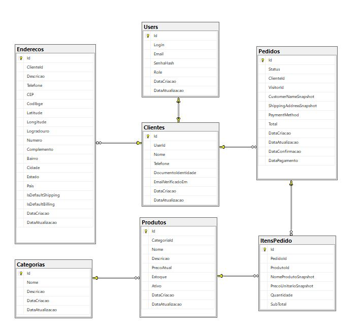

<h1 align="center">🖥️ TechStore API</h1>

Backend arquitetado para um e-commerce moderno com mentalidade de engenharia profissional.

<b>“Comece simples. Proteja o que é crítico.”</b>

---

> ⚡ **Abra o Swagger e teste a API em menos de 1 minuto.**

👉 **Swagger:**  
https://techstorelinux-production.up.railway.app/swagger/index.html

## 🚀 Acesse a TechStore API

  

  📡 <strong>Produção (Railway)</strong> 
  👉 https://bit.ly/4akQwIS

👉 **Repositório (Linux / Produção):**  
https://github.com/dmm76/techstore_linux

👉 **Repositório (Windows / Desenvolvimento):**  
https://github.com/dmm76/pucpr_volvo

> Sem setup. Sem instalação. Apenas abra e teste.

---

## 🧠 Sobre o Projeto

O **TechStore** é uma Web API construída em **.NET**, projetada com foco em previsibilidade, baixo acoplamento e evolução segura.

O sistema evoluiu de uma infraestrutura fake — utilizada estrategicamente para amadurecimento do domínio — para **persistência real com Entity Framework Core e SQL Server**, preservando estabilidade arquitetural e evitando refatorações de alto risco.

> **Arquitetura não é sobre perfeição inicial — é sobre evolução controlada.**

---

## ⭐ Engineering Highlights

Este projeto foi construído com decisões típicas de sistemas profissionais:

✔ Middleware global para tratamento de exceções  
✔ Domínio rico com regras centralizadas  
✔ Snapshot de dados sensíveis para preservar histórico  
✔ Separação clara entre camadas  
✔ Preparado para autenticação stateless  
✔ Arquitetura pensada para crescimento

> Mais do que funcionar — o sistema foi projetado para ser sustentável.

---

## 🏗️ Arquitetura (Visão Executiva)

O TechStore segue uma separação clara de responsabilidades, priorizando manutenibilidade e previsibilidade do software.

📐 **Acesse a documentação completa:**  
👉 [Architecture — TechStore](ARCHITECTURE.md)

---

## 🗄️ Modelo do Banco

  

---

## ⚙️ Stack Tecnológica

- .NET
- ASP.NET Core
- Entity Framework Core
- SQL Server
- Swagger
- Railway

---

## 🚀 Capacidades do Sistema

### 🛍️ Produtos

✅ CRUD completo  
✅ Paginação  
✅ Filtros dinâmicos  
✅ Validações de domínio  
✅ Tratamento de erros padronizado

---

### 🧾 Pedidos (Fluxo Crítico)

✔ Carrinho nasce com visitante  
✔ Snapshot de preço evita distorções futuras  
✔ Estoque validado antes da confirmação  
✔ Baixa automática impede venda fantasma  
✔ Pedido vinculado ao usuário na finalização

> **Software crítico exige previsibilidade — não improviso.**

---

### 📊 Relatórios

✅ Total vendido por categoria

Estrutura preparada para expansão futura.

---

## 🔐 Segurança

✔ Autorização baseada em papéis (**Admin / User**)  
✔ Guards aplicados em endpoints críticos  
✔ Ownership garantindo isolamento de dados  
✔ Middleware centralizado de exceções

O uso atual de autenticação em memória é uma decisão consciente para simplificação acadêmica, mantendo o sistema preparado para evolução futura.

---

## 📚 Documentação Técnica

A documentação detalhada foi organizada em arquivos dedicados para manter o README objetivo e facilitar a navegação arquitetural do projeto.

- 📐 [Arquitetura](ARCHITECTURE.md)
- 🧠 [Decisões Arquiteturais (ADR)](DECISIONS.md)
- 📊 [Project Overview](PROJECT_OVERVIEW.md)
- ⚠️ [Dívidas Técnicas](TECH_DEBT_PT.md)
- 🔐 [Dívidas de Segurança](TECH_DEBT_SECURITY.md)

---

## 🎯 Próxima Evolução

- Autenticação com JWT
- Refresh Tokens
- Observabilidade
- Logs estruturados
- Testes automatizados
- Cache
- Rate limiting

> Evoluir sem comprometer a estabilidade é o objetivo.

---

## 👨‍💻 Autor

**Douglas Marcelo Monquero**  
Engenharia de Software — UniCesumar

---

## 💡 Filosofia

> **“Você não precisa começar perfeito.  
> Só precisa evitar erros perigosos:  
> estado público, regra espalhada, dependência acoplada e modelos anêmicos.”**

> Arquitetura não elimina complexidade —  
> ela impede que a complexidade vire caos.
